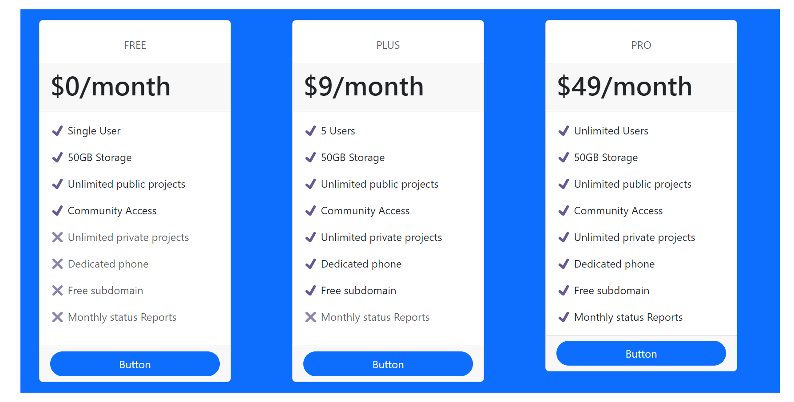

## React Shopping website

**Description**

- This mini project is to perform adding and removing items to the card.

## Software

- vs-code
- React js

**Requirements**

- The shopping cart should display a list of available products with their name and description.
- Users should be able to add items to the cart by clicking the "Add to Cart" button.
- When an item is added to the cart, the cart quantity number should be increased.
- The "Add to Cart" button should be changed to the "Remove from Cart" button once the item is added to the cart.
- Users should be able to remove items from the cart by clicking the "Remove from Cart" button.
- When an item is removed from the cart, the cart quantity number should be decreased.
- The "Remove from Cart" button should be changed back to the "Add to Cart" button once the item is removed from the cart.

## Output

